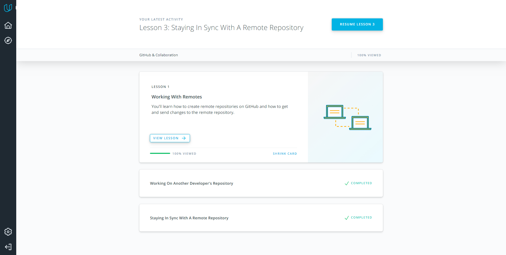
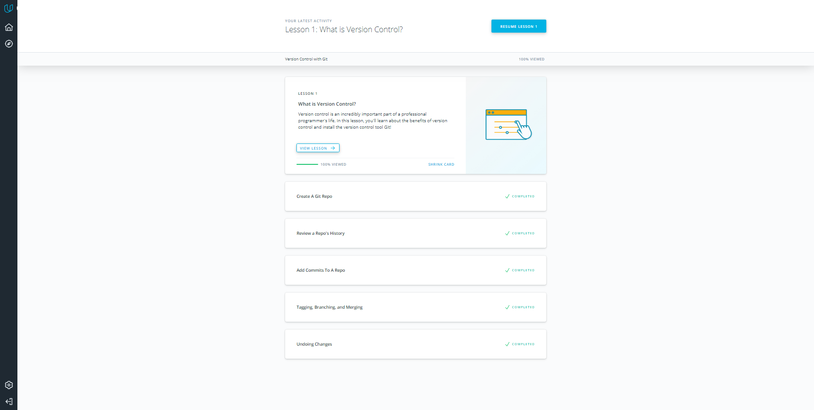
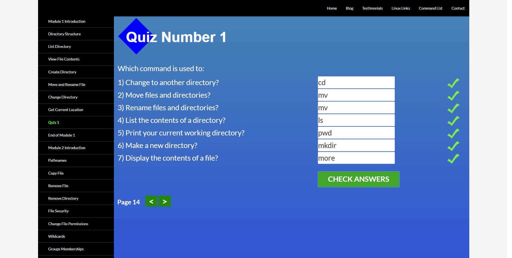
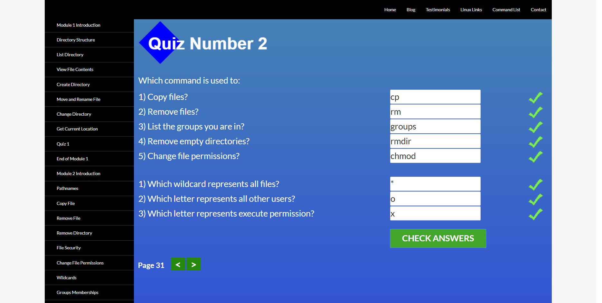
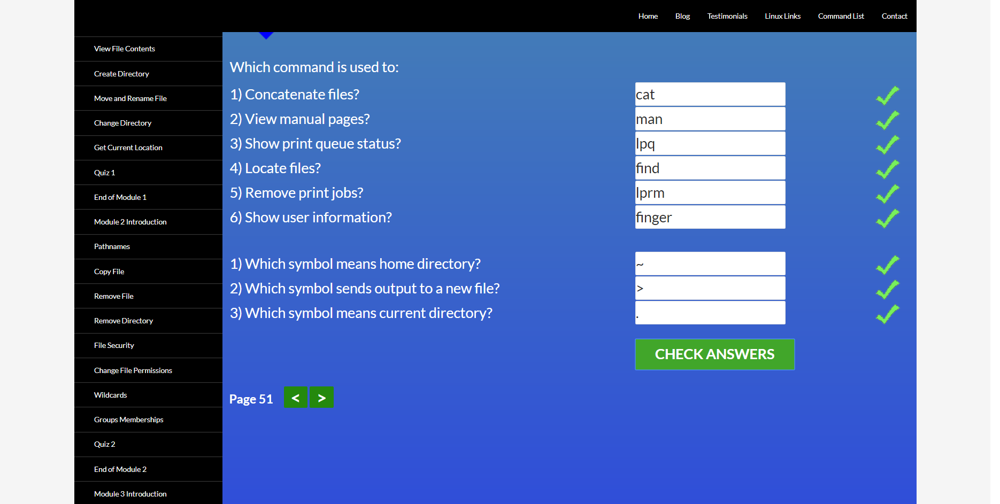
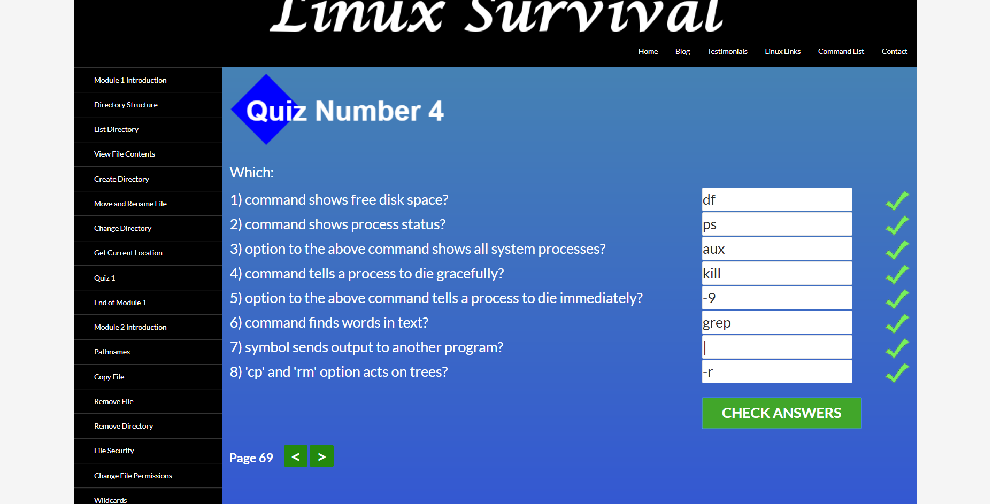
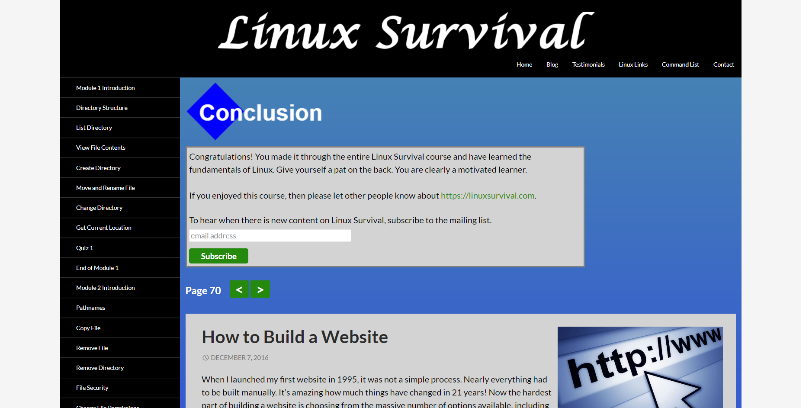

## Git Collaboration
In 0 point of general basics of the course I had been learned about git and GitHub and I spend much time to learn not provided extra material on this topic. But here I found smth new also. In many problems I look from a different angle and I had a good practice to make remote repos and interact with them. Anyway there exist plenty more information about git what I should know and of course **practice and more an more practice**
Some screenshots after tasked cources: 

## Linux CLI, and HTTP
This part of the cource I past fast because during my learning previous part about Git and Git Hub I had learned plenty extra materials what included Linux comand line also.
	
About HTTP protocol I found out a bit during my learning course SC50 (Ukrainian adoption on prometheus.org). Provided article is great for content but it hard for understanding for begginer.Thats great that Ukrainian version exists.
	
Also I spend some time for extra materials.

As I understand I add some screenshots of Linux Survival course: 

# kottans-frontend
Wow! 
I've learnt just some lessons about Git... It is both simple and hard imlement. Much left to find out more but basics are done. 
