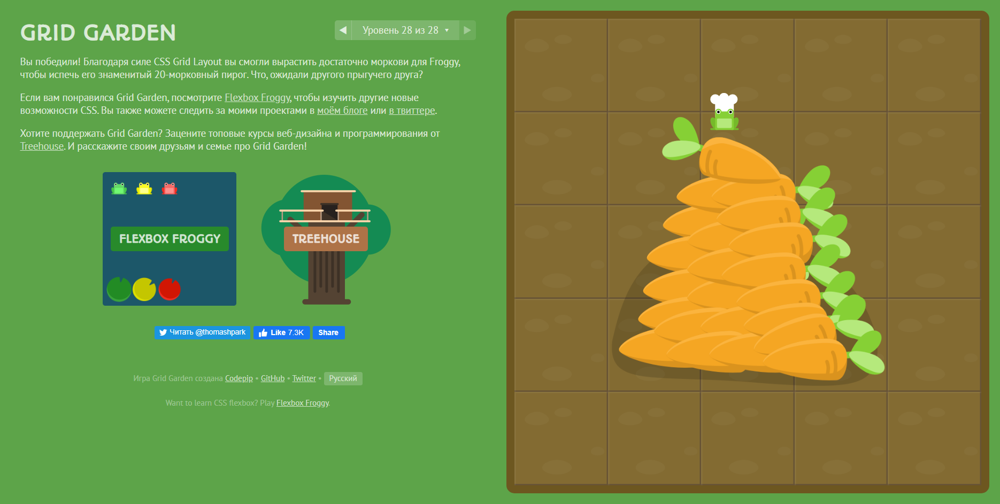

## JS Basics

I finished to learn JavaScript basic. During the challenge I find out much new js features. Also it was good coding practice for me. This chalenge motivate me to learn deeper about algorithms. I have started some lessons.

<h4>1. Intro to JS (Udemy)</h4>

I thought it will be easy for me because I mentioned I know some javascript basics, but it it turned out that I know only very basics.  Conditions and loops I catch very fast. It was hard to understand recursive functions and I still feel not familiar with them. In my algorithms lessons I try to pay more attention for this problem. It makes code like art 😎. 
Arrays and objects explosured my brain. Thats why it is interesting. Thats why I feel I should to tame this great powerfull tool 💪.
 
 
<h4>FreeCodeCamp exercises</h4>

Basic JavaScript I passed quite easy. I did't feel some problems. 
During ES6 challenge I was confused because I had not know about what kinds of changes used to be with JS language. I had not so much practice with previous versions of JS. I find out what difference between <i>let</i>, <i>var</i> and <i>const</i>. I met arrow functions, template literal, "strict mode", <i>Object.freeze</i>, class keywords, promise constructor function, then and catch methods and plenty new for me 😵. 

I decided not to jump from task to task but tried to pass all chapters one by one to reach described challenges.

Another big topic what I learned is regular expressions pattern. Truly say, I still can't undestand it. Different flags, character sets, like <q>[^ \r\t\f\n\v]</q>, make you brain upload ❗️ .

In <i>Basic Data Strure</i> section I learned deeper object and arrays.

In <i>Basic Algorithm Scripting</i> I solved some small problems which become more serious in <i>Intermediate Algorithm Scripting Challenges</i>.

<i>Functional Programming</i> is an object oriented programming organizes code into object definitions.  I learned here that the object structure makes it flexible within a program.
Objects can transfer information by calling and passing data to another object's methods.
Objects can have a special type of property, called a method.

And finally I really got stuck at <i>Algorithm Scripting Challenges</i>. I honestly tried to solve it by myself but many times google helped me😊. Sometimes I used hints incide this challenges. But I felt myself really great when I solved that problems without help. 

 
I spent a lot of time learning some extra matherials(like <a href="https://ru.hexlet.io/courses/introduction_to_programming" target="_blank">haxlet<a/>): 

## HTML & CSS practice: Hooli-style Popup
This task was first with some kind of practice. I deside use Grid method combining it with Flex. 
First of all I did looked at mockup that page is not difficult and it needs only one list with main-manu and also one or two sublists for popup menu. Main menu had been done pretty fast and it start to be difficult when I tried to do popup menu. Pseudo element **::before** helped to do it what I learned while the task had being doing. Also another pseudoelements I used to complete the task.
As I had some problems before pushing this task to github I made some extra <a href="https://github.com/t-jay-777/popup-style-menu" target="_blank">repo</a>.

## Responsive Web Design
While I had been passing <a href="https://www.udacity.com/course/responsive-web-design-fundamentals--ud893">Responsive Web Design</a> I found in extra matherials link to <a href="https://www.udacity.com/course/responsive-images--ud882">Responsive Images</a> course. I guess both them should be learned. I had known about responsive web design but I hadn't imaged all this problem. In my training projects I tried do smth "responsive" but after the courses I know this problem much better. I found out a lot about @media queries, relative measures, <picture></picture>, templates and many other things. Some meta datas could help make responsive design also. I learned some technics how to do **adoptive** design. Now I understand better how to manage images in my future projects. I should pay more attention for img formats. Also I found out the power of fonts, CSS background images, icons, svg images. I know now about such powerful tools like **srcset** and **sizes**(attribute). All problems showed in this two courses were interesting and I spend more time to learn that deep. 

  This problem will learned much more by me :blush:. 
Games <a href="http://flexboxfroggy.com/#ru">FLEXBOX FROGGY</a> and <a href="https://codepip.com/games/grid-garden/">Grid Garden</a> were interestig also and helped me to understand a bit flexbox and grid. 

 
Unfortunatelly I cant say it about <a href="https://mastery.games/p/flexbox-zombies">Flexbox Zombies</a>.

## Intro to HTML and CSS
Couple month ago I had won as a prise <a href="https://geekbrains.ru/courses/246">HTML/CSS course</a> so I can say that I had recognized a bit about <a href="https://github.com/t-jay-777/kottans-frontend/blob/master/html_css_intro/geekbrains_html_css_basic.en.pdf" title="Certificate">web-page design</a>. But I had found <a href="https://htmlacademy.ru" title="htmlacademy.ru">here</a> also much useful information for me: tables, selectors, page markup etc. 
It was so interesting, that I forgot about 2 free chapters and I don't know how could pass more. 

 
But I'm glad of it. Some information are refreshed and some are new for me. 
Udacity course is for very begginers 
 
Extra material also are in my learning process. I will try to get certification <a href="https://www.freecodecamp.org" title="freecodecamp.org">here</a>.

## Git Collaboration
In 0 stage of general basics of the course I had been learned about git and GitHub and I spend much time to learn not provided extra material on this topic. But here I found smth new also. In many problems I look from a different angle and I had a good practice to make remote repos and interact with them. Anyway there exist plenty more information about git what I should know and of course **practice and more an more practice**
Some screenshots after tasked cources: 

## Linux CLI, and HTTP
This part of the cource I past fast because during my learning previous part about Git and Git Hub I had learned plenty extra materials what included Linux comand line also.
	
About HTTP protocol I found out a bit during my learning course SC50 (Ukrainian adoption on prometheus.org). Provided article is great for content but it hard for understanding for begginer.Thats great that Ukrainian version exists.
	
Also I spend some time for extra materials.

As I understand I add some screenshots of Linux Survival course: 

# kottans-frontend
Wow! 
I've learnt just some lessons about Git... It is both simple and hard imlement. Much left to find out more but basics are done. 
